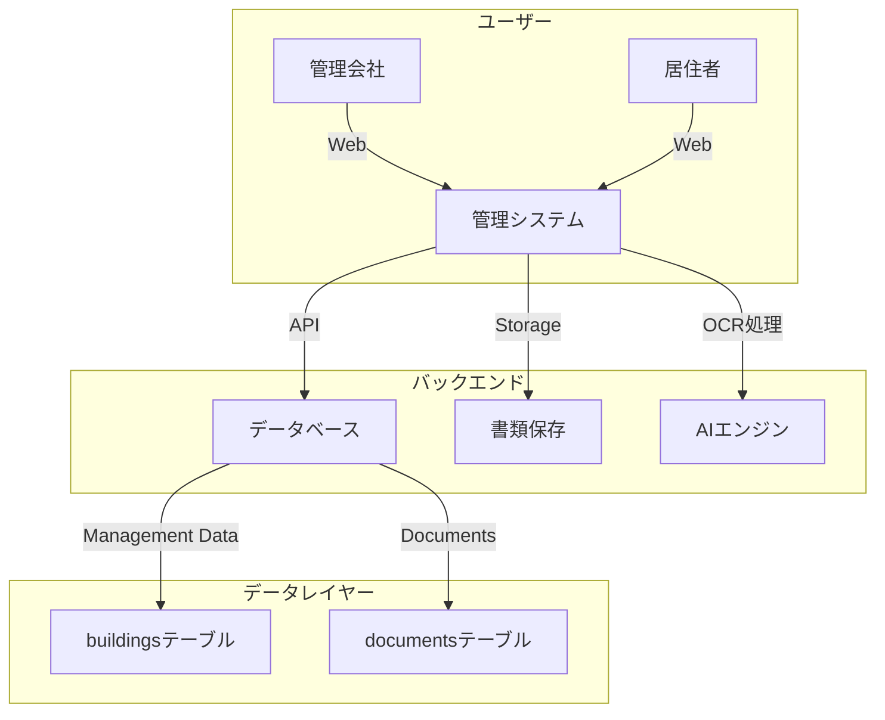
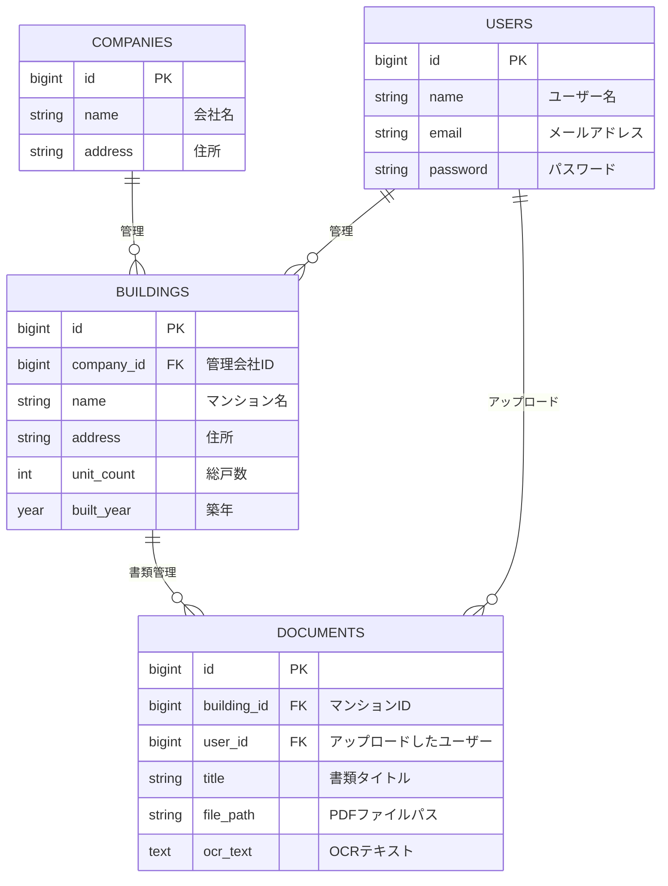

# 🏢 分識マンション管理システム「しめすくん」 設計書

## **1. 概要**

本システムは、分識マンションの管理業務を効率化するためのプラットフォームです。  
マンションの重要書類を **電子化・Web 化** し、**高度な AI 検索** を提供します。

## **2. 機能一覧**

-   📝 **書類管理**
    -   PDF アップロード・OCR 処理（テキスト抽出）
    -   書類の全文検索・AI 応答機能
-   🏢 **マンション情報管理**
    -   マンションごとの基本情報（住所・築年数・総房数など）
    -   書類との結び付け
-   🛠️ **管理会社向け機能**
    -   マンションごとの書類を統合管理
    -   居住者向けのアクセス制御
-   🔍 **AI による質問応答**
    -   書類を基にした高度な Q&A 機能（NotebookLM 的な機能）
    -   検索性の向上（全文検索 + 自然言語処理）

---

## **3. システム構成**

---

## **7. データベース設計**

## **📌 ER 図**

